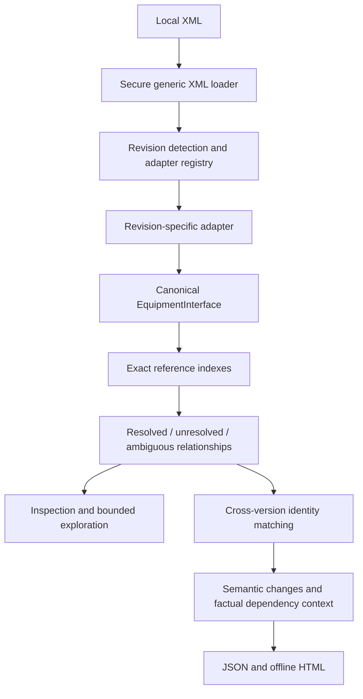

# Architecture

The [master product contract](../MASTER_PRODUCT_CONTRACT.md) defines the product's
boundaries. The semantic core consumes canonical objects independent of XML revision.

| Module | Responsibility |
| --- | --- |
| `parser` | Bound local XML; retain generic nodes, namespaces, and source positions |
| `adapters` | Detect/select revisions; map evidenced syntax; preserve unsupported information |
| `model` | Immutable typed entities, exact identifiers, references, provenance, unknowns, canonical JSON |
| `graph` | Collision-preserving indexes, exhaustive outcomes, adjacency, bounded dependency joins |
| `compare` | Identity matching, properties, relationships, documentation, explicit uncertainty |
| `report` | Public report projections/change codes, schemas, escaped offline HTML |
| `cli` | File-loading orchestration, exact selectors/filters, controlled errors and output |
| `diagnostics`, `limits`, `local_files` | Shared source/entity diagnostics, work budgets, local path policy |

The loader has no E172 admission rules. Revision interpretation belongs to the registry
and adapter. Only `adapters/defaults.py` composes the default `E172_0225Adapter`.
Graph, matching, comparison, and report renderers never import that adapter. File
facades and CLI compose loading with canonical APIs. Tests use fictional adapters
and block concrete-adapter imports downstream.

Adapters parse observed entities/selectors and record pending resolution. A separate
phase indexes and gives every reference one outcome. Unknown sections remain opaque;
missing and ambiguous targets stay explicit. Diagnostics include code, severity,
source/location, and entity context.

Document-local `key` identifies an occurrence, not continuity across versions. Matching
evaluates exact signals across both inventories and retains collisions/conflicts.
Comparison reconciles confirmed identities before evaluating relationship endpoints.
Source coordinates and inventory order are ignored; protocol sequence order, report
member order, duplicate members, and exact scalar text remain meaningful.

Dependency context follows supported resolved paths and reports factual counts.
Graph/output budgets abort exhausted operations rather than dropping evidence.
Inputs remain immutable. Normal product writes are caller-selected HTML outputs,
guarded against input aliases and replaced atomically.

Public entry points include `load_interface`, `resolve_references`, `match_interfaces`,
`compare_interfaces`, `to_canonical_json`, `report_from_changes`, and `report_files`.
See [canonical model](canonical_model.md), [matching](entity_matching.md),
[comparison](semantic_changes.md), [revisions](supported_revisions.md),
[diagnostics](diagnostics.md), and [security](security.md) for contracts.
